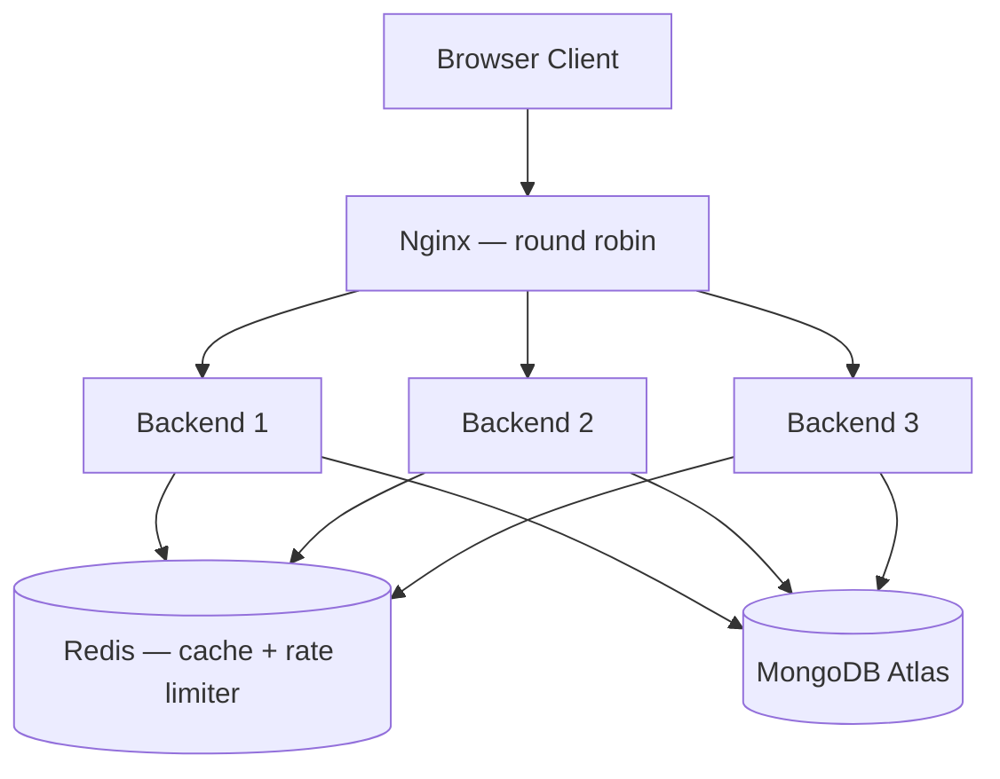

# lnk

A production-grade URL shortener built as a hands-on system design exercise — scaled from a single-process prototype to a horizontally-scaled, cached, rate-limited, load-tested, observable service handling 1000+ concurrent users.

[](https://github.com/mohdfaizan091/url-shortener/actions/workflows/backend-ci.yml)

## What it does

Paste a long URL, get a short one back. Click it, get redirected — fast, cached, and correctly tracked even under heavy concurrent load. Built specifically to explore and prove out real distributed-systems concepts: atomicity, caching, rate limiting, horizontal scaling, and observability — not just "make a shortener," but make one that survives scale.

## Architecture



Every backend instance is completely stateless — no in-memory data of any kind. Click counts, cache, rate-limit tokens, and the short-code counter all live in Redis/MongoDB, shared across all instances. That's what makes it safe to run 3 (or 30) identical copies behind a load balancer.

## Engineering decisions

- **Atomic click tracking** — `findOneAndUpdate` + `$inc` instead of read-modify-write, eliminating a real race condition where concurrent clicks on the same link could silently lose counts. Redirect responses are never blocked on the analytics write.
- **Counter-based Base62 key generation** — replaced a random-`nanoid`-plus-collision-check-loop scheme with an atomic, auto-incrementing counter encoded in Base62. O(1) generation, zero collision checks, ever.
- **Redis cache-aside** — redirect traffic is heavily skewed toward a small number of hot links; caching the redirect lookup removes most read load from MongoDB. Fails open (falls back to Mongo) if Redis is unreachable, with a tuned fast-fail retry strategy so an outage degrades performance rather than availability.
- **Token bucket rate limiting** — Redis-backed, atomic via a Lua script, keyed by IP (forward-compatible with per-user limiting once auth exists). Protects `/shorten` from abuse without needing a queue or external service.
- **Horizontal scaling** — Dockerized backend, 3 replica instances behind an Nginx load balancer. Verified round-robin distribution and confirmed the rate limiter's shared Redis state holds correctly regardless of which instance handles a given request.
- **CI/CD** — GitHub Actions runs the full test suite (including a live Redis service container) on every push.
- **Observability** — structured JSON request logging (pino), with sensitive headers redacted, and a Prometheus-compatible `/metrics` endpoint tracking request counts and latency histograms.

## Load testing results

Tested locally with k6, full stack running via Docker Compose (3 backend instances + Nginx + Redis + MongoDB Atlas). Load generator and target shared the same machine — a cleaner test would run from separate hardware against a deployed instance.

**Redirect endpoint (`GET /:shortCode`)** — 200 concurrent virtual users, sustained 30s:
- **935 req/s** throughput, 40,845 total requests
- **p95 latency: 126.74ms** (threshold: <500ms) ✅
- **99.98% success rate**

**Shorten endpoint (`POST /shorten`)** — 2 req/s sustained, 20s (rate-limited by design, not a throughput test):
- 100% of requests correctly returned either `201` (allowed) or `429` (rate-limited), confirming the token bucket holds up under sustained load, not just a manual burst.

## Tech stack

**Backend:** Node.js, Express, MongoDB Atlas, Mongoose, Redis (ioredis), Docker, Nginx, GitHub Actions, k6, pino, prom-client, Jest, Supertest, mongodb-memory-server

**Frontend:** React, Vite, Tailwind CSS, Axios

## Running locally

**Backend:**
```bash
cd backend
npm install
```
Create `backend/.env`:
```
MONGO_URL=<your MongoDB Atlas connection string>
REDIS_URL=redis://localhost:6379
PORT=4000
```
```bash
npm run dev
```

**Frontend:**
```bash
cd url-shortener-frontend
npm install
```
Create `url-shortener-frontend/.env`:
```
VITE_API_URL=http://localhost:4000
```
```bash
npm run dev
```

**Full stack via Docker (3 backend instances + Nginx + Redis):**

Create a `.env` at the project root:
```
MONGO_URL=<your MongoDB Atlas connection string>
```
```bash
docker-compose up --build
```
App available at `http://localhost` (through Nginx), backend directly unreachable on individual ports — that's intentional, all traffic routes through the load balancer.

**Running tests:**
```bash
cd backend
npm test
```

**Load tests:**
```bash
cd backend/load-tests
node seed.js        # seed short codes for the redirect test
k6 run redirect-test.js
k6 run shorten-test.js
```

## API

| Method | Route | Description |
|---|---|---|
| `POST` | `/shorten` | Create a short URL (rate-limited: 5 requests, refills 1/sec) |
| `GET` | `/:shortCode` | Redirect to the original URL, tracks a click |
| `GET` | `/analytics/:shortCode` | Get click count and metadata for a short code |
| `GET` | `/health` | Health check |
| `GET` | `/metrics` | Prometheus-format metrics |

## What's next

- Deployment (hosted Redis, backend + frontend live on a real domain)
- Authentication (per-user links, dashboards) — navbar already has placeholder Log in / Sign up UI, not yet wired to a backend

## Author

Mohd Faizan — [GitHub](https://github.com/mohdfaizan091) · [LinkedIn](https://linkedin.com/in/mohd-faizan)